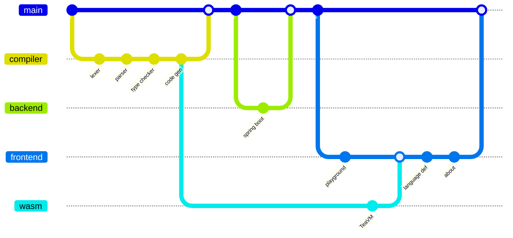
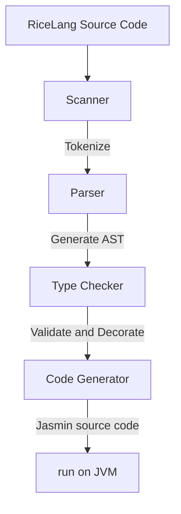
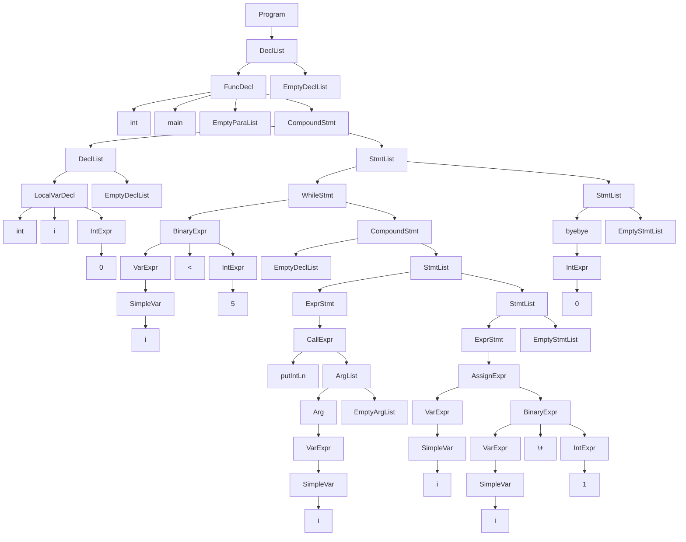
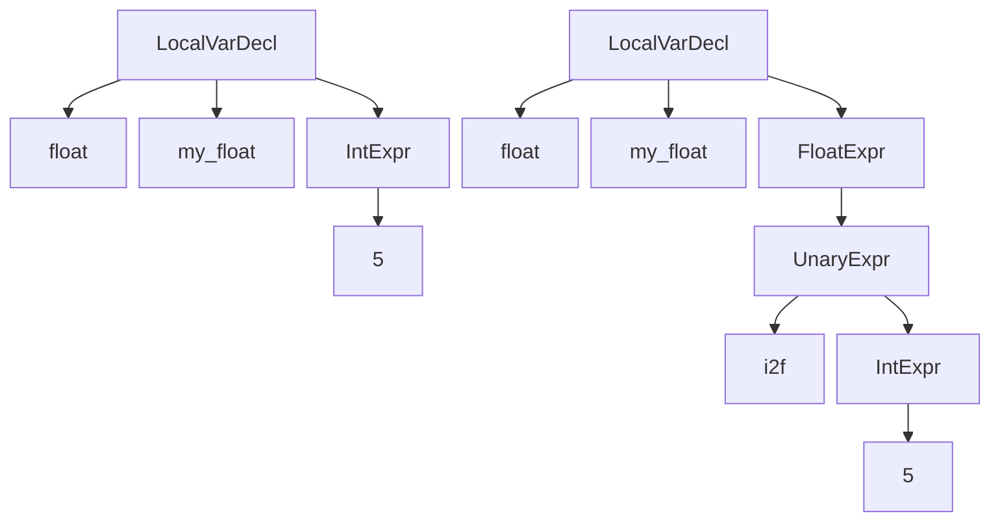
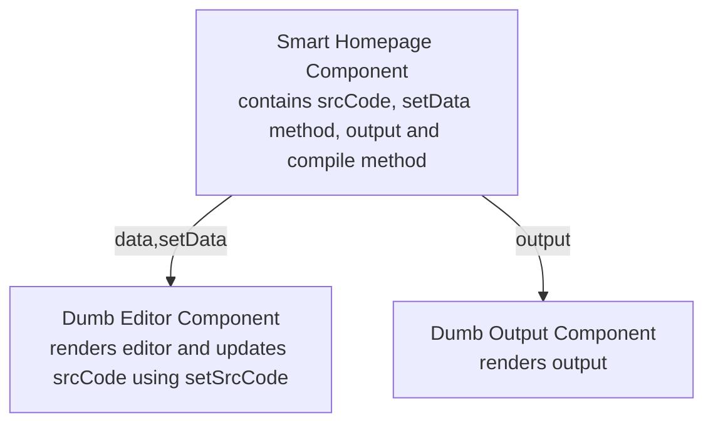
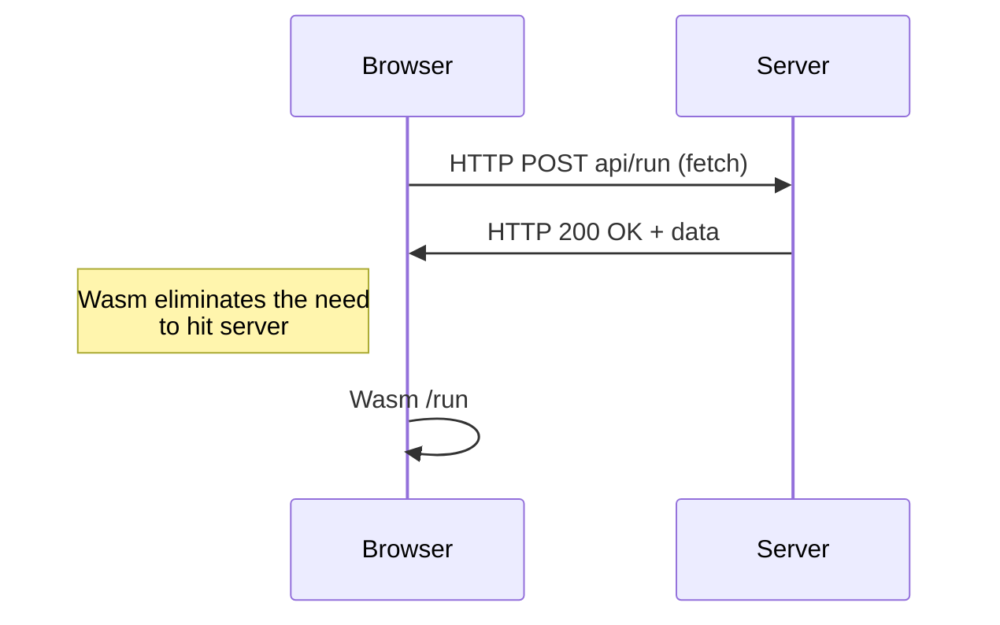

# About

## Contents

## Introduction

This page is a high level run down on how I turned this idea into a completed personal project.

This playground was conceived to provide an accessible way to try out the compiler for my programming language, RiceLang. Its creation can be categorised into 4 main sections.

- [Compiler](#compiler)
- [Backend](#backend)
- [Frontend](#frontend)
- [Wasm](#wasm)



## Compiler

The compiler turns RiceLang source code into Java byte code much like other popular JVM languages including [Scala](https://scala-lang.org/), [Groovy](https://groovy-lang.org/) and [Kotlin](https://kotlinlang.org/). It does this ahead-of-time in 4 steps to eventually be run on the JVM.



### Scanner

The scanner takes the source code and returns tokens. It will return tokens according to the [grammar](https://ricelang-playground.vercel.app/language-definition#grammar) and detect any syntactical errors. This means it will ignore comments, tokenize numbers according to the longest match, detect keywords and enforce rules like local variable declarations being at the top of a compound statement. Additionally, it will store information regarding the token's position (line and column number) to allow users to debug their RiceLang code. It does this one character at a time choosing between either looking ahead or consuming the character to add to the current token's spelling.

Rather than turning the entire source code into an array of tokens in one pass, it instead provides a `getToken` method which the parser can call as it builds the AST. In this way the code can be streamed and be more memory efficient.

### Parser

The parser is an [LL(1) recursive parser](https://wikipedia.org/wiki/LL_parser). It will take the tokens from the scanner and generate an Abstract Syntax Tree (AST). An AST is an immediate tree-like representation of the program that defines how the program is to be executed.

It checks that the tokens returned by the scanner are valid in the given context (like if a `while` keyword is returned, it will check that the next token is an open bracket followed by an expression and a closing bracket). While the brackets are required syntactically, they are not necessary in the AST as it encodes this information within its structure.

The parser will also encode the precedence of instructions of the program for various statements. It does this by recursively building the tree according to the grammar and putting operations with higher precedence closer to the leaf nodes.

As an example, the code below

```ricelang
int main() {
	int i = 0;
	while (i < 5) {
		putIntLn(i);
		i = i + 1;
	}
	byebye 0;
}
```

will generate the following AST



As the AST is generated with all its nodes, a `Visitor` interface is produced to allow further modification and reading of this intermediate state.

### Type Checker

The type checker, as the name implies, validates the types in the AST generated by the parser. The AST can be accessed with the `Visitor` interface that provides a way to visit all the possible types of nodes. In one pass, the checker ensures that functions are called with the correct number and type of arguments, operations are applied to valid types, conditionals for `if` and `while` statements are booleans and the such are checked.

As it is checking, it will also do type coercions from `int` to `floats` for assignments, mixed binary expressions, function calls and return statements. This is done by passing around inherited and synthesised [attributes](https://wikipedia.org/wiki/Attribute_grammar) while implementing the `Visitor` interface.

```ricelang
int i = 2;
float f = i; // i is converted 2.0
int i_2 = f; // Error: cannot convert from float to int
```

Specifically, a float declaration with an int would change the AST by adding an unary expression with the `i2f` operation. Below shows two charts before and after type coercion.



As the coercion is done, changing the overloaded operators to their respective type is also done. This is because instructions like the addition of 2 integers versus 2 floats requires different Java byte code instructions. For example, `1 + 2` and `1.0 + 2.0` both use the `+` operator. However, they would be changed to `1 i+ 2` and `1.0 f+ 2.0` respectively to disambiguate the `+` operator to make code generation easier down the line.

The checker also ensures scope rules are adhered to while linking identifiers of functions and variables to their declarations by maintaining a [symbol table](https://wikipedia.org/wiki/Symbol_table) during the pass. This includes guaranteeing that there are no duplicate local variable declarations in the same scope and such. Furthermore, it will also do some miscellaneous decoration like when an array declaration has an empty subscript, it will use the length of the array initializer or if a `for` loop has an empty conditional it will insert a `true` literal.

### Code Generator

The Code Generator takes the decorated AST from the checker and assumes that it is fully valid so that Jasmin source code can be generated. [Jasmin](https://jasmin.sourceforge.net/) is an assembler for the Java virtual machine meaning that it can take the source code and turn it into a Java class file. It is written as a [stack machine](https://wikipedia.org/wiki/Stack_machine) where you can load things like array pointers, variables and constants onto the stack and operate on them.

The Code Generator also implements the `Visitor` class and converts the meaning held in the AST (like the precedence and associativity) and generates the assembler code.

The following RiceLang code

```ricelang
while (true) putStringLn("hello");
```

Would translate to something along these lines

```jasmin
beginWhileLabel:
	iconst_1              ; true
	ifeq endWhileLabel    ; if false goto Label

	; load java's printStream and "hello" onto the stack in order to print
	getstatic java.lang.System.out Ljava.io.PrintStream;
	ldc "hello"

	; invoking println consumes the PrintStream and the "hello" so
	; that nothing is left on the stack afterwards
	invokevirtual java.io.PrintStream.println(Ljava.lang.String;)V

	goto beginWhileLabel  ; loop to start again
endWhileLabel:
```

The code generation process is where behaviour like short circuiting and cascading assignment is actually done. However, all these operations on the stack machine require declarations of the maximum stack height and number of local variables within a method so that the amount of memory that needs to be used is known before running the code. This information is calculated by simulating pushes and pops on the stack with a `frame` object that gets passed around the `Visitor` class to eventually be used by the function declaration.

The generator has been designed to produce a Java `Object` class file with an initialiser for doing some setup and a main method that maps to the RiceLang source code's main function. In the initialiser, global variables are declared as static variables of that class while also adding a global scanner for any `getInt` or `getFloat` class to read stdin. It will define the functions in the RiceLang program as methods in the class.

With this `Object` class, it is ready to be turned into a Java class file by the Jasmin assembler.

### JVM

Once a Java class file is generated by the assembler, it is as simple as running `java file` in the terminal. This is because I specifically chose to only use built in Java libraries like `java.io` and `java.util` so that no meddling of environment classpaths needs to be done.

At this stage one would typically need to compile RiceLang code to Jasmin assembler code, compile that to a Java class file and then run that file on the JVM. So I migrated the project to [Gradle](https://gradle.org/) and made some `build.gradle` tasks for running RiceLang code on the JVM in a single `run` command.

Overall, the compiler was complete in the span of about 10 weeks. Woohoo! It worked perfectly fine on any JVM to produce cool programs like a gcd calculator, a Mandelbrot set and the such thanks to the '[Write once, run anywhere](https://wikipedia.org/wiki/Write_once,_run_anywhere)' philosophy of Java. Though complete for terminal use, it was time to make it more accessible by deploying it to the web.

## Backend

As the compiler was written in Java, it was only natural that Java based backend should be reached for. This led me to the very popular [Spring Boot](https://docs.spring.io/spring-boot/) in order to create a simple [RESTful](https://wikipedia.org/wiki/REST) web service.

I simply made an application and chucked on some decorators to accept `POST` requests with the source code in a [JSON](https://json.org) body. The server would then compile the code to Java byte code and then run it on the JVM while piping the output into a local string so that it could be returned as a response.

Making a `/run` route was so simple, I decided to also make routes like `/jasmin` for just returning the Jasmin assembler code and `/ast` for returning the AST.

There were multiple considerations for how I could approach sending an AST response. In the end, I landed on generating [MermaidJS](https://mermaid.js.org/) source code due to its conciseness, clarity and popularity being used in software like [GitHub](https://github.com/) and [Obsidian](https://obsidian.md). This meant that I could send less over the wire to improve performance and have the frontend render the visualisation. So I created a simple class that implemented the `Visitor` pattern which would generate the AST.

With the server working locally, I decided to add a [Dockerfile](https://www.docker.com/) to ensure that the server would be deployed with [jdk17](https://openjdk.org/projects/jdk/17/) so that it could run the compiled Java byte code and build the server to eventually expose the routes to the world. To complete it, I decided to use [render](https://render.com/) to host and deploy the server.

A simple working [curl](https://curl.se/) request to test both the local and deployed server meant it was time to move on to the frontend.

```bash
curl -H 'Content-Type: application/json' \
	-d '{ "sourceCode":"int main() { byebye 0; }"}' \
	-X POST \
	127.0.0.1:8080/run # can replace with actual route
```

## Frontend

For the building of the frontend, I decided to take it easy and stick with what I already knew; [React](https://react.dev/) and [Tailwind](https://tailwindcss.com/). So, I landed on the extremely popular [Nextjs](https://nextjs.org/) and [Shadcn](https://ui.shadcn.com/) to build out my frontend and provide a user facing website to showcase my compiler. What better way to do that than to make a playground.

### Playground

A code playground is a place to write and run code online without having to do any manual setup yourself. It consists of 2 main parts; the editor and the output. While I could have made something along the lines of existing playgrounds like the [rust one](https://play.rust-lang.org/), I wanted the experience to feel cooler. So, taking inspiration from some [linux ricing](https://www.reddit.com/r/unixporn/), I decided to design the website to look like it was a [tiling window manager](https://wikipedia.org/wiki/Tiling_window_manager).

As is typical with the design of [React](https://react.dev/) components, you have a '_smart_' component for maintaining the data and dumb components for simple rendering. The homepage would be the smart component and the editor and output would be the dumb components. It would then provide the child components with the data and methods to use and manipulate the data to allow for both modular code and sharing of state.



The window with the editor would use [Monaco](https://microsoft.github.io/monaco-editor/) the editor that powers [VS Code](https://code.visualstudio.com/). This is because in addition to having syntax highlighting for custom languages, it also had [VS Code](https://code.visualstudio.com/) shortcuts like `Ctrl` + `D` for making multiple selections. Because [Monaco](https://microsoft.github.io/monaco-editor/) requires a definition for a custom language, regular expressions were used to match identifiers, keywords, string literals, numbers and the such. With a little bit of customisation and using the hooks for setting source code, the editor half was complete and able to switch between the default [VS Code](https://code.visualstudio.com/) light and dark theme based on the theme context.

The output window was quite simple for text output; wait for the parent to make a fetch to the backend, and then render the output in monospaced font. As for the rendering of the [MermaidJS](https://mermaid.js.org) source code to an AST visualisation, just using the `render` function as provided by the [npm package](https://npmjs.com/package/mermaid) was all that was needed.

After a little tinkering to prevent unnecessary re-renders with [react's memoization](https://react.dev/reference/react/useMemo), the basic functionality was complete. Although all was well, I decided to sneak in some [jotai](https://jotai.org) for state management to remove the `useMemo` calls and the passing of props because of how much fun I had with [zustand](https://zustand-demo.pmnd.rs/) (another state management system from [poimandres](https://pmnd.rs/)) in other projects I'd been working on. Migrating to [jotai](https://jotai.org) was not too difficult of a learning curve. Having it replace some context providers and `useEffect` calls into plain `.ts` files made my code so much more beautiful. Overall, a lovely library to work with for granularity.

### Wasm

While the [Spring Boot](https://spring.io/projects/spring-boot) backend worked correctly, the idea of removing packet delay / latency altogether seemed extremely desirable especially with [render](https://render.com) services spinning down after periods of inactivity. So, I decided to turn my compiler into [Web Assembly](https://webassembly.org/) with the help of [TeaVM](https://teavm.org/) which is an ahead-of-time compiler that converts Java into Wasm (specifically Wasm Garbage Collection (WasmGC)).



Because the [Wasm](https://webassembly.org/) runtime doesn't have access to I/O, it meant that the main `/run` route couldn't be compiled with [TeaVM](https://teavm.org/) directly. So, I wrote a JavaScript transpiler by implementing the `Visitor` class yet again to produce vanilla JS so that it could run in the browser. I used the `prompt` function for stdin and just saved stdout to an array to later be used to `console.log`. [TeaVM](https://teavm.org/) made this quite lovely as all I had to do was change some logic to only use compatible Java libraries and then simply add some decorators to some exported binding functions. Then I would just copy the binaries over to the frontend and have them loaded once in a [context](https://react.dev/reference/react/createContext) to be used throughout the [React](https://react.dev/) app.

This worked beautifully with both [SpiderMonkey](https://spidermonkey.dev/) for Firefox and [V8](https://v8.dev/) for Chromium while having a minimal affect on TTI (Time to Interactive) as the binary was only `800kb`. This gave an average `200x` improvement in performance from `1000ms` to `5ms` for a typical `/run`. If the backend had spun down, performance increases upwards of `20000x` could be achieved (`100000ms` to `5ms`). With such an improvement, I made Wasm the default with an optional legacy route if true JVM compilation was desired.

However, [WebKit](https://webkit.org/) (for Safari and all browsers in iOS) was not able to properly load the WasmGC module (A [TeaVM issue](https://github.com/konsoletyper/teavm/issues/1028) seems to blame it on Apple). Because of this, I made a simple fallback to the [Spring Boot](https://spring.io/projects/spring-boot) backend if any errors were found in the [Wasm](https://webassembly.org/) initialisation.

Interestingly, I could have also compiled to [Wasm WAT](https://webassembly.github.io/spec/core/exec/index.html) for it also is a stack machine like [Jasmin](https://jasmin.sourceforge.net/) meaning that it wouldn't be totally foreign as a task to complete. However, I have left this as an exercise for the reader.

### Other pages

A good language definition / documentation is crucial for users to be able to understand a new programming language. So, I decided to write one in [markdown](https://markdownguide.org/) and then use [remark](https://remark.js.org/) to turn it into html.

I wrote formal definitions of RiceLang syntax in [Latex](https://wikipedia.org/wiki/Latex) delimited by `$$` signs and had [Katex](https://katex.org/) convert it to html. As examples are also great in documentation, I had created a custom [highlight.js](https://highlightjs.org/) definition to incorporate syntax highlighting when showing RiceLang code snippets. It was also important that my documentation would purposefully incorporate redundancy. This would be so that readers would be able to look at a single section and understand it without having to reference other parts of the documentation. While I did have to implement some custom logic for code styles and opening external links in new tabs, the [unified](https://unifiedjs.com/) functional interface was lovely to work with producing the following code.

```javascript
const html = await unified()
  .use(remarkParse)  // parse the markdown
  .use(remarkMath)   // identify latex blocks
  .use(remarkToc)    // populate table of contents
  .use(remarkRehype) // convert to html ast
  .use(rehypeSlug)   // add ids to headers
  .use(rehypeHighlight, { languages: { bash, javascript, jasmin, ricelang } })
  .use(rehypeKatex, { output: 'html', trust: true }) // render latex
  .use(addLanguageDataAttribute)   // add data-label for css ::before label
  .use(openExternalLinksInNewTabs) // add target="_blank" for links
  .use(rehypeStringify)
  .process(await fs.readFile('./about.md', 'utf8'););
```

With this, I was able to write the documentation in [markdown](https://markdownguide.org/) / [Obsidian](https://obsidian.md) and have it compiled to html at build time with static site generation automatically thanks to the [Nextjs app router](https://nextjs.org/docs/app). Having one source of truth is always lovely to have.

Similar to the Language Definition page, I wrote this about page in [markdown](https://markdownguide.org/) / [Obsidian](https://obsidian.md) and then had it converted to html at build time (although the [Mermaid](https://mermaid.js.org/) diagrams are hydrated on the client side). This made the writing process so much more enjoyable.

## Conclusion

The project took around 14 weeks to complete and was very rewarding. I learnt a lot about compilers, Wasm and everything else required to build the playground. Overall, a great project for the books.

### Technologies

- [Java](https://www.java.com/) + [Gradle](https://gradle.org/)
- [Jasmin](https://jasmin.sourceforge.net/)
- [Spring Boot](https://spring.io/projects/spring-boot)
- [Nextjs](https://nextjs.org/) + [React](https://react.dev/)
- [Shadcn](https://ui.shadcn.com/) + [Tailwind](https://tailwindcss.com/)
- [Monaco](https://microsoft.github.io/monaco-editor/)
- [Mermaid](https://mermaid.js.org/)
- [Markdown](https://markdownguide.org/) + [remark](https://remark.js.org/)
- [TeaVM](https://teavm.org/)
- [Jotai](https://jotai.org)
- [Vercel](https://vercel.com)
- [Render](https://render.com)
- [Docker](https://docker.com)

All the code is available on my github at [https://github.com/RiceL123/ricelang-playground](https://github.com/RiceL123/ricelang-playground).

If you would like more of a personal take with my learnings and pain points while developing the project you can check [my blog](https://ricel123.vercel.app/)~!
