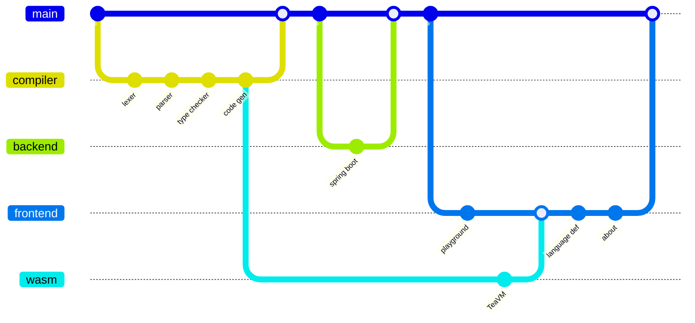
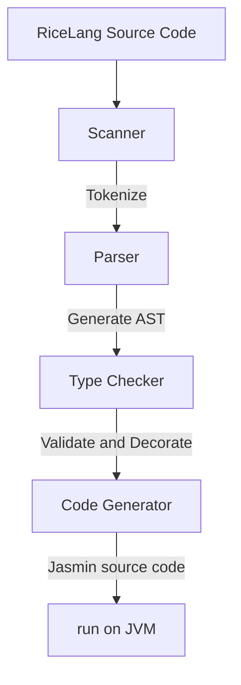
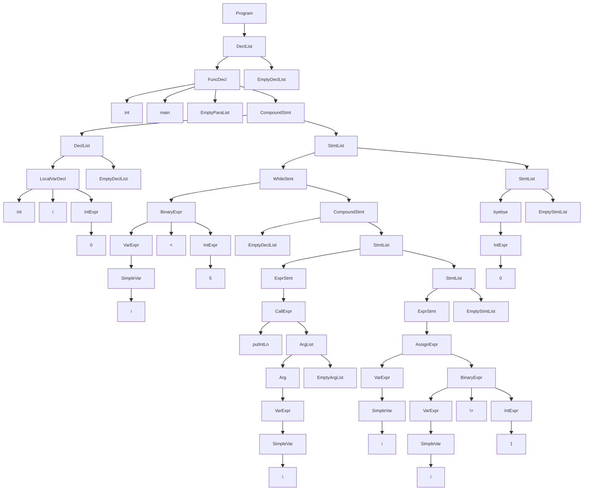
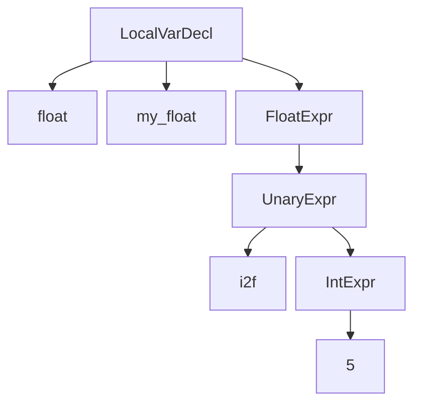

# About

## Contents

## Introduction
This page is a high level run down on how I turned this idea into a completed personal project.


This playground was conceived to provide an accessible way to try out the compiler for my programming language, RiceLang. Its creation can be categorised into 4 main sections.


- [Compiler](#Compiler)
- [Backend](#Backend)
- [Frontend](#Frontend)
- [Wasm](#Wasm)



## Compiler
The compiler turns RiceLang source code into Java byte code much like other popular JVM languages including [Scala](https://scala-lang.org/), [Groovy](https://groovy-lang.org/) and [Kotlin](https://kotlinlang.org/). It does this ahead-of-time in 4 steps to eventually be run on the JVM.



### Scanner
The scanner takes the source code and return tokens. It will return tokens according to the [grammar](https://ricelang-playground.vercel.app/language-definition#grammar) and detect any syntactical errors. This means it will ignore comments, tokenize numbers according to the longest match, detect keywords and enforce rules like local variable declarations being at the top of a compound statement. Additionally, it will store information regarding the token's position (line and column number) to allow users to debug their RiceLang code. It does this one character at a time choosing between either looking ahead or consuming the character to add to the current token's spelling.


Rather than turning the entire source code into an array of tokens in one pass, it instead provides a `getToken` method which the parser can call as it builds the AST. In this way the code can be streamed and be more memory efficient.
### Parser
The parser is an [LL(1) recursive parser](https://wikipedia.org/wiki/LL_parser). It will take the tokens from the scanner and generate an Abstract Syntax Tree (AST). An AST is an immediate representation of the program that defines how the program is to be executed.


It checks that the tokens returned by the scanner are valid in the given context (like if a `while` keyword is returned, it will check that the next token is an open bracket followed by an expression and a closing bracket). While the brackets are required syntactically, they are not necessary as the AST encodes this information within its structure.


The parser will also encode the precedence of instructions of the program for various statements. It does this by recursively building the tree according to the grammar.


As an example, the code below

```ricelang
int main() {
	int i = 0;
	while (i < 5) {
		putIntLn(i);
		i = i + 1;
	}
	byebye 0;
}
```

will generate the following AST



### Type Checker
The type checker, as the name implies, validates the types in AST generated by the parser. The AST can be accessed with the `Visitor` interface that provides a way to visit all the possible types of nodes. In one pass, the checker ensures that functions are called with the correct number and type of arguments, operations are applied to valid types, conditionals for `if` and `while` statements are booleans and the such are checked.

As it is checking, it will also do type coercions from `int` to `floats` for assignments, mixed binary expressions, function calls and return statements. This is done by passing inherited and synthesised attributes while implementing the `Visitor` interface.

```ricelang
int i = 2;
float f = i; // i is converted 2.0
int i_2 = f; // Error: cannot convert from float to int
```

Specifically, a float declaration with an int would change the AST by adding an unary expression with the `i2f` operation as follows.


As the coercion is done, changing the overloaded operators to their respective type is also done. This is because instructions like the addition of 2 integers requires a separate Java byte code instruction to the addition of 2 floats despite `1+2` and `1.0+2.0` both using the `+` operator. Specifically, they would be changed to `1 i+ 2` and `1.0 f+ 2.0` respectively to distinguish them.

The checker also ensures scope rules are adhered to while linking identifiers of functions and variables to their declarations by maintaining a symbol table during the pass. This includes guaranteeing that there are no duplicate local variable declarations in the same scope and such. Furthermore, it will also do some miscellaneous decoration like when an array declaration has a empty subscript, it will use the length of the array initializer or if a `for` loop has an empty conditional it will insert a `true` literal.
### Code Generator
The Code Generator takes the decorated AST from the checker and assumes that it is fully valid so that Jasmin source code can be generated. [Jasmin](https://jasmin.sourceforge.net/) is an assembler for the Java virtual machine meaning that it can take the source code and turn it into a Java class file. It is written as a [stack machine](https://wikipedia.org/wiki/Stack_machine) where you can load things like array pointers, variables and constants onto the stack and operate on them.

The Code Generator also implements the `Visitor` class converts the meaning held in the AST (like the precedence and associativity) and generates the assembler code.

The following RiceLang code

```ricelang
while (true) putStringLn("hello");
```

Would translate to something along these lines
```jasmin
beginWhileLabel:
	iconst_1              ; true
	ifeq endWhileLabel    ; if false goto Label

	; load java's printStream and "hello" onto the stack in order to print
	getstatic java.lang.System.out Ljava.io.PrintStream;
	ldc "hello"

	; invoking println consumes the PrintStream and the "hello" so
	; that nothing is left on the stack afterwards
	invokevirtual java.io.PrintStream.println(Ljava.lang.String;)V
	
	goto beginWhileLabel  ; loop to start again
endWhileLabel:
```

The code generation process is where behaviour like short circuiting, cascading assignment is actually done. However, all these operations on the stack machine require declarations of the maximum stack height and number of local variables so that the amount of memory that needs to be used is known before running the code. This information is calculated by simulating pushes and pops on the stack with a `frame` object that gets pass around the `Visitor` class to eventually be used by the function declaration. 

The generator has been designed do produce a Java class file with an initialiser for doing some setup and a main method that maps to the RiceLang source code main function. In the initialiser, a global variables are declared as static variables of that class while also adding a global scanner for any `getInt` or `getFloat` class to read stdin. It will define the functions in the RiceLang program as methods in the class.

With this this Object class, it is ready to be turned into a Java class file by the Jasmin assembler.
### JVM
Once a Java class file is generated by the assembler, it is as simple as running `java file` in the terminal. This is because I specifically chose to only use built in Java libraries like `java.io` and `java.util` so that no meddling of environment classpaths need to be done. 

At this stage one would typically need to compile RiceLang code to Jasmin assembler code, compile that to a Java class file and then run that file on the JVM. So I migrated the project to [Gradle](https://gradle.org/) and used made some `build.gradle` tasks for running RiceLang code on the JVM in a single command.

Overall, the compiler was complete in the span of about 10 weeks! It worked perfectly fine on any JVM to produce cool programs like a gcd calculator, a Mandelbrot set and the such thanks to the '[Write once, run anywhere](https://wikipedia.org/wiki/Write_once,_run_anywhere)' philosophy of Java. Though complete for terminal use, it was time to make it more accessible by deploying it to the web.
## Backend
As the compiler was written in Java, it was only natural that Java based backend should be reached for. This lead me to the very popular [Spring Boot](https://docs.spring.io/spring-boot/) in order to create a simple [RESTful](https://wikipedia.org/wiki/REST) web service.

I simply made an application, chucked on some decorators to accept `POST` requests with the source code in a JSON body. The server would then compile the code to Java byte code and then run it on the JVM piping the output so that it could be returned as a response.

Making a `/run` route was so simple, I decided to also make routes like `/jasmin` for just returning the Jasmin assembler code  and `/ast` for returning the AST.

There were multiple considerations for how I could approach sending an AST response. In the end, I landed on generating [MermaidJS](https://mermaid.js.org/) due to its conciseness, clarity and popularity being used in software like GitHub and [Obsidian](https://obsidian.md). This meant that I could send less over the wire to improve performance and have the frontend render the visualisation. So I created a simple class that implemented the `Visitor` pattern which would generate the AST.

With the server working locally, I decided to add a [Dockerfile](https://www.docker.com/) to ensure that the server would be deployed with [jdk17](https://openjdk.org/projects/jdk/17/) so that it could run the compiled Java byte code and build the server to eventually expose the routes to the world. To complete it, I decided to use [render](https://render.com/) to host and deploy the server.
## Frontend
For the building the frontend, I decided to take it easy and stick with what I already knew; [React](https://react.dev/) and [Tailwind](https://tailwindcss.com/). So, I landed on the extremely popular [Nextjs](https://nextjs.org/) and [Shadcn](https://ui.shadcn.com/) to build out my frontend and provide a user facing website to showcase my compiler. What better way to do that than to make a playground.
### Playground
A code playground is a place to write and run code on online without having to do any manual setup yourself. It consists of 2 main parts; the editor and the output. While I could have made something along the lines of existing playgrounds like the [rust one](https://play.rust-lang.org/), I wanted experience to feel cooler. So, taking inspiration from some [linux ricing](https://www.reddit.com/r/unixporn/), I decided to design the website to look like it was [tiling window manager](https://wikipedia.org/wiki/Tiling_window_manager).

### Wasm

### Language Def

### About
You are reading the about page right now! Honestly writing out my process can feel meddlesome at times but the page wouldn't complete without it! 
## Conclusion
Overall, there were a multitude of technologies used to get this working including

### Technologies
- [Java](https://www.java.com/) + [Gradle](https://gradle.org/)
- [Jasmin](https://jasmin.sourceforge.net/)
- [Spring Boot](https://spring.io/projects/spring-boot)
- [Nextjs](https://nextjs.org/) + [React](https://react.dev/)
- [Shadcn](https://ui.shadcn.com/) + [Tailwind](https://tailwindcss.com/)
- [Monaco](https://microsoft.github.io/monaco-editor/)
- [Mermaid](https://mermaid.js.org/)
- [Markdown](https://markdownguide.org/) + [remark](https://remark.js.org/)
- [TeaVM](https://teavm.org/)

All the code is available on my github at [https://github.com/RiceL123/ricelang-playground](https://github.com/RiceL123/ricelang-playground).

If you would like more of a personal take with my learnings and pain points while developing the project you can check [my blog](https://ricel123.vercel.app/)~!
