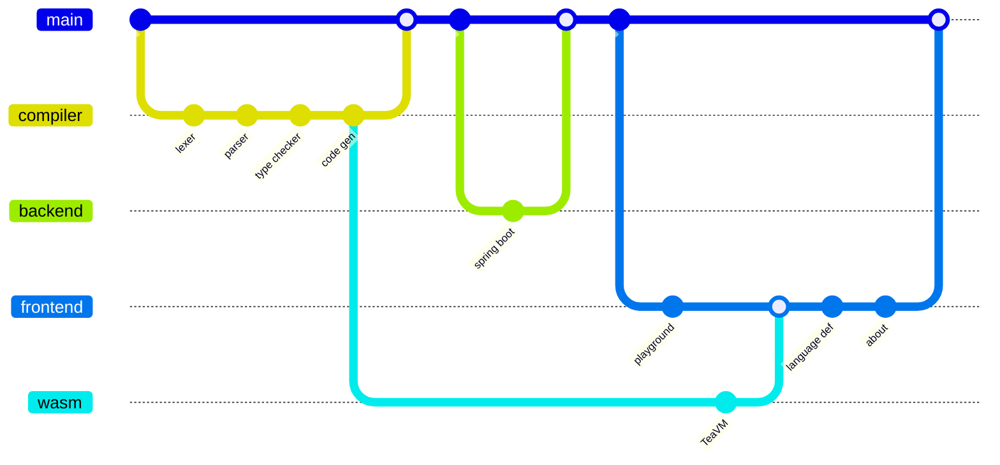
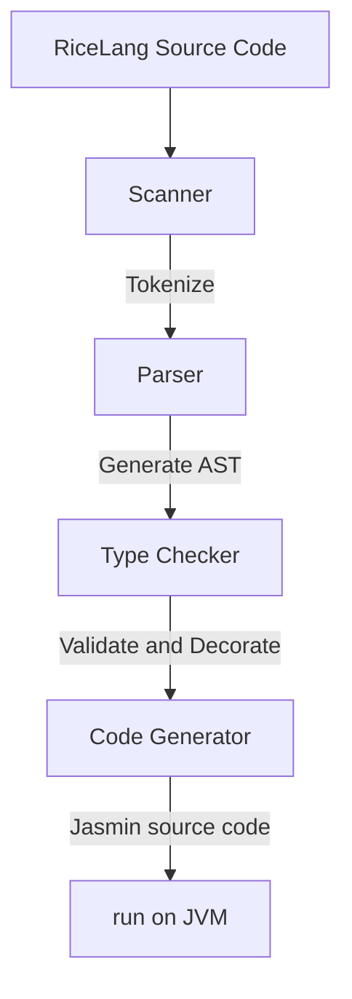
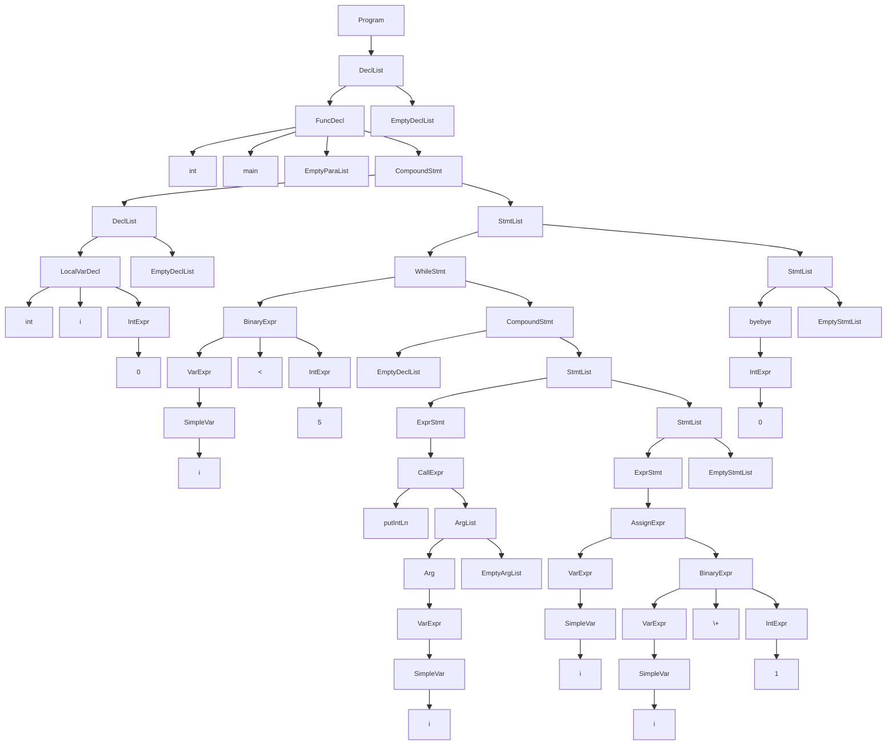

# About

## Contents

## Introduction
This page is a high level run down on how I turned this idea into a completed personal project.

This playground was conceived to provide an accessible way to try out the compiler for my programming language, RiceLang. Its creation can be categorised into 4 main sections.

- [Compiler](#Compiler)
- [Backend](#Backend)
- [Frontend](#Frontend)
- [Wasm](#Wasm)


## Compiler
The compiler turns RiceLang source code into Java byte code much like other popular JVM languages including [Scala](https://scala-lang.org/), [Groovy](https://groovy-lang.org/) and [Kotlin](https://kotlinlang.org/). It does this ahead-of-time in 4 steps to eventually be run on the JVM.



### Scanner
The scanner takes the source code and return tokens. It will return tokens according to the [grammar](https://ricelang-playground.vercel.app/language-definition#grammar) and detect any syntactical errors. This means it will ignore comments, tokenize numbers according to the longest match, detect keywords and enforce rules like local variable declarations being at the top of a compound statement. Additionally, it will store information regarding the token's position (line and column number) to allow users to debug their RiceLang code.

Rather than turning the entire source code into an array of tokens in one pass, it instead provides a `getToken` method which the parser can call as it builds the AST. In this way the code can be streamed and be more memory efficient.
### Parser
The parser is an LL(1) recursive parser. It will take the tokens from the scanner and generate an Abstract Syntax Tree (AST). An AST is an immediate representation of the program that defines how the program is to be executed.

It checks that the tokens returned by the scanner are valid in the given context (like if a `while` keyword is returned, it will check that the next token is an open bracket followed by an expression and a closing bracket). While the brackets are required syntactically, they are not necessary as the AST encodes this information within its structure.

The parser will also encode the precedence of instructions of the program for various statements. 

As an example, the code below

```ricelang
int main() {
	int i = 0;
	while (i < 5) {
		putIntLn(i);
		i = i + 1;
	}
	byebye 0;
}
```

will generate the following AST



### Type Checker
The type checker, as the name implies, validates the types in 1 pass of the AST generated by the parser. This means it ensures that functions are called with the correct number and type of arguments, the correct operations are used to for the specific types, conditionals for statements are booleans and the such are checked.
It will also ensure scope rules are adhered to and link variable and function uses to their declarations
### Code Generator

### JVM

## Backend

## Frontend

### Playground

### Wasm

### Language Def

### About

## Conclusion
Overall, there were a multitude of technologies used to get this working including

### Technologies
- [Java](https://www.java.com/) + [Gradle](https://gradle.org/)
- [Jasmin](https://jasmin.sourceforge.net/)
- [Spring Boot](https://spring.io/projects/spring-boot)
- [Nextjs](https://nextjs.org/) + [React](https://react.dev/)
- [Shadcn](https://ui.shadcn.com/) + [Tailwind](https://tailwindcss.com/)
- [Monaco](https://microsoft.github.io/monaco-editor/)
- [Mermaid](https://mermaid.js.org/)
- [Markdown](https://markdownguide.org/) + [remark](https://remark.js.org/)
- [TeaVM](https://teavm.org/)

All the code is available on my github at https://github.com/RiceL123/ricelang-playground.

If you like more of a personal take on the project you can check it out on [my blog](https://ricel123.vercel.app/)~!
